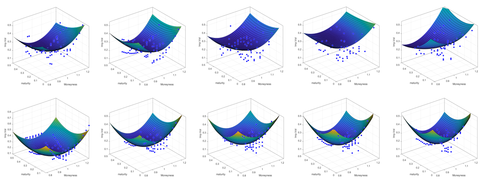
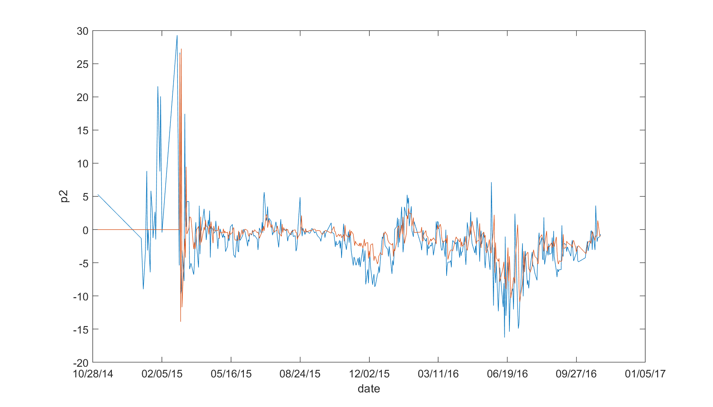
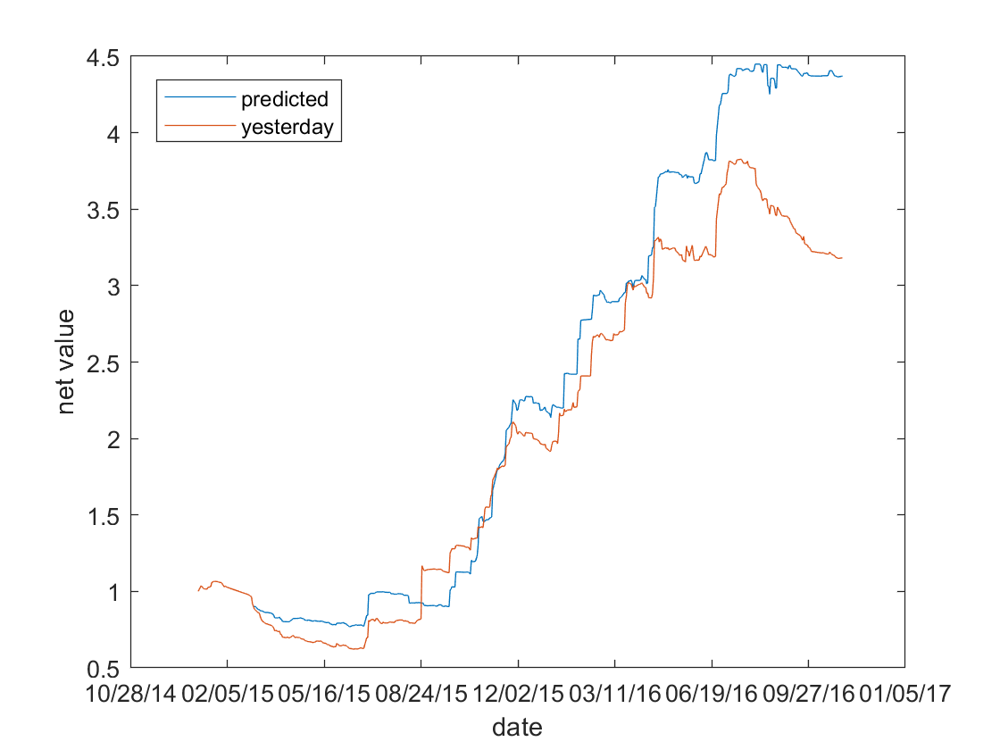

### Implied Volitality Model
#### This repository contains all the material used for the final project of course *Computer Programming in Financial Engineering* developed by Kai Xiang, including all the codes, reference, data etc.

#### Several studies are finished in this project
1. Collect option data of several stocks and indexes that are traded in Shanghai Stock Exchange. Link is [here](https://github.com/kylerse/implied-volitality-model/tree/master/data)
2. Using a multi-factor model to model the implied volatility surface.

3. ARMA(2,1) model to predict nextday's parameters.

4. Kalman Filter (unfinished)
5. Trading strategy comparision.

